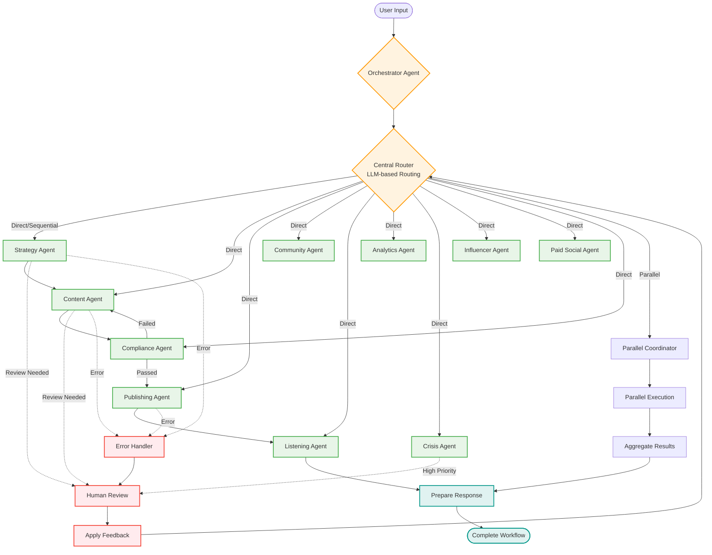

# AI Social Media Manager - Graph Architecture

```mermaid
graph TD
    %% Entry Points
    START([User Input]) --> ORCHESTRATOR{Orchestrator Agent}
    ORCHESTRATOR --> ROUTER{Central Router<br/>LLM-based Routing}
    
    %% Core Agents
    ROUTER -->|Direct/Sequential| STRATEGY[Strategy Agent]
    ROUTER -->|Direct| CONTENT[Content Agent]
    ROUTER -->|Direct| PUBLISHING[Publishing Agent]
    ROUTER -->|Direct| COMMUNITY[Community Agent]
    ROUTER -->|Direct| LISTENING[Listening Agent]
    ROUTER -->|Direct| ANALYTICS[Analytics Agent]
    
    %% Specialized Agents
    ROUTER -->|Direct| CRISIS[Crisis Agent]
    ROUTER -->|Direct| INFLUENCER[Influencer Agent]
    ROUTER -->|Direct| PAID_SOCIAL[Paid Social Agent]
    ROUTER -->|Direct| COMPLIANCE[Compliance Agent]
    
    %% Parallel Execution
    ROUTER -->|Parallel| PARALLEL_COORD[Parallel Coordinator]
    PARALLEL_COORD --> PARALLEL_EXEC[Parallel Execution]
    PARALLEL_EXEC --> AGGREGATE[Aggregate Results]
    
    %% Sequential Workflow
    STRATEGY --> CONTENT
    CONTENT --> COMPLIANCE
    COMPLIANCE -->|Passed| PUBLISHING
    COMPLIANCE -->|Failed| CONTENT
    PUBLISHING --> LISTENING
    
    %% Human Review
    STRATEGY -.->|Review Needed| HUMAN[Human Review]
    CONTENT -.->|Review Needed| HUMAN
    CRISIS -.->|High Priority| HUMAN
    HUMAN --> APPLY_FEEDBACK[Apply Feedback]
    APPLY_FEEDBACK --> ROUTER
    
    %% Error Handling
    STRATEGY -.->|Error| ERROR[Error Handler]
    CONTENT -.->|Error| ERROR
    PUBLISHING -.->|Error| ERROR
    ERROR --> HUMAN
    
    %% Final Steps
    LISTENING --> PREPARE[Prepare Response]
    AGGREGATE --> PREPARE
    PREPARE --> COMPLETE([Complete Workflow])
    
    %% Styling
    classDef agentNode fill:#e8f5e8,stroke:#4caf50,stroke-width:2px
    classDef routerNode fill:#fff3e0,stroke:#ff9800,stroke-width:2px
    classDef humanNode fill:#ffebee,stroke:#f44336,stroke-width:2px
    classDef finalNode fill:#e0f2f1,stroke:#009688,stroke-width:2px
    
    class STRATEGY,CONTENT,PUBLISHING,COMMUNITY,LISTENING,ANALYTICS agentNode
    class CRISIS,INFLUENCER,PAID_SOCIAL,COMPLIANCE agentNode
    class ORCHESTRATOR,ROUTER routerNode
    class HUMAN,ERROR,APPLY_FEEDBACK humanNode
    class PREPARE,COMPLETE finalNode
```